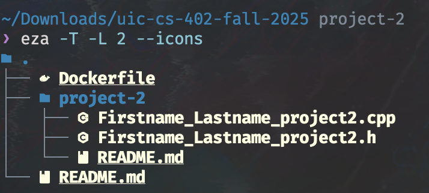
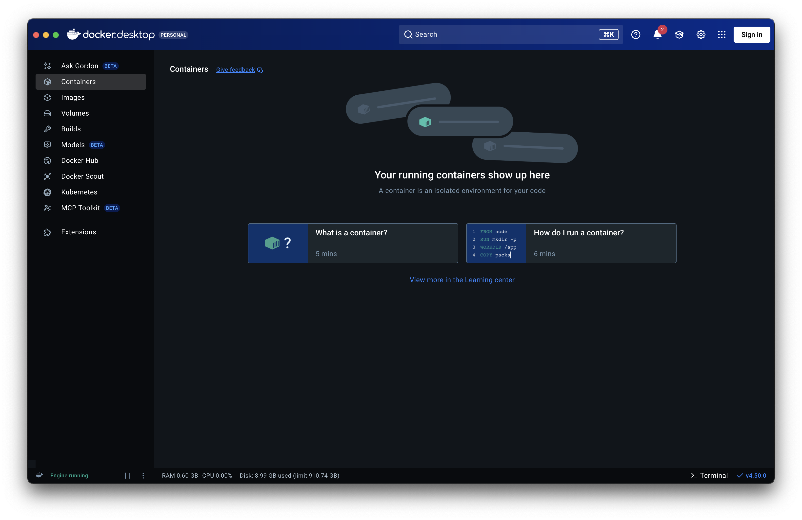
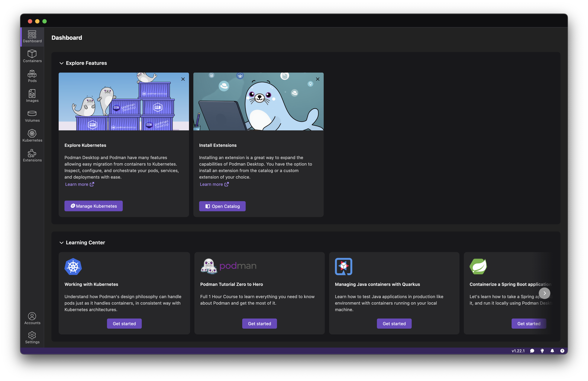
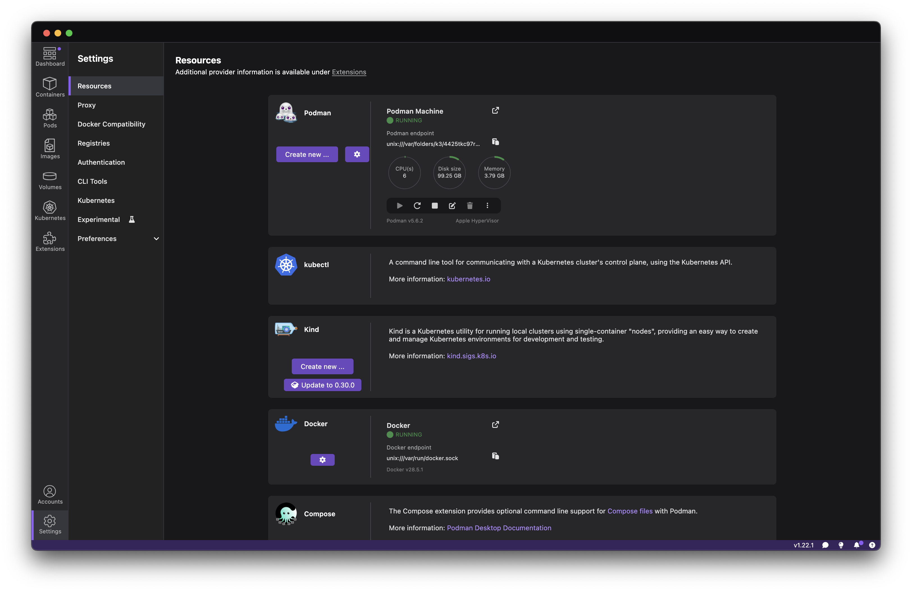
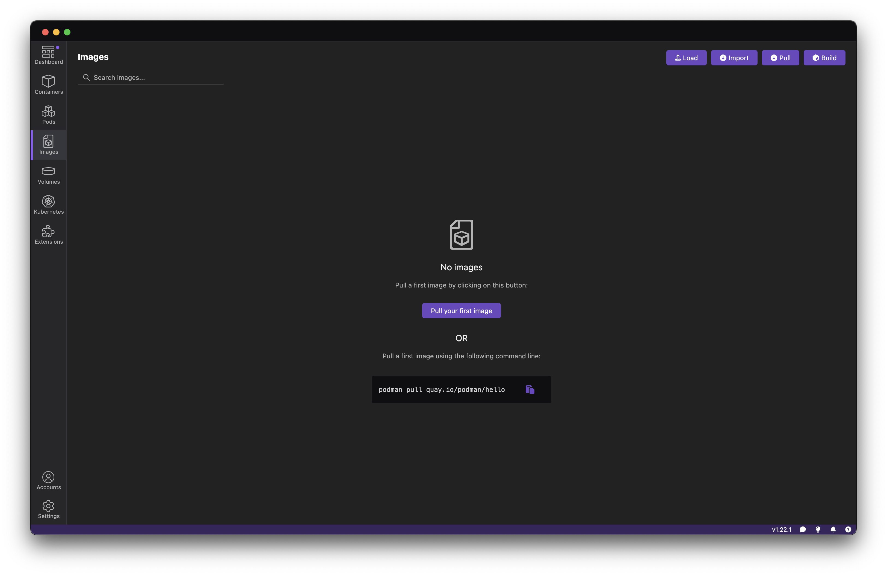
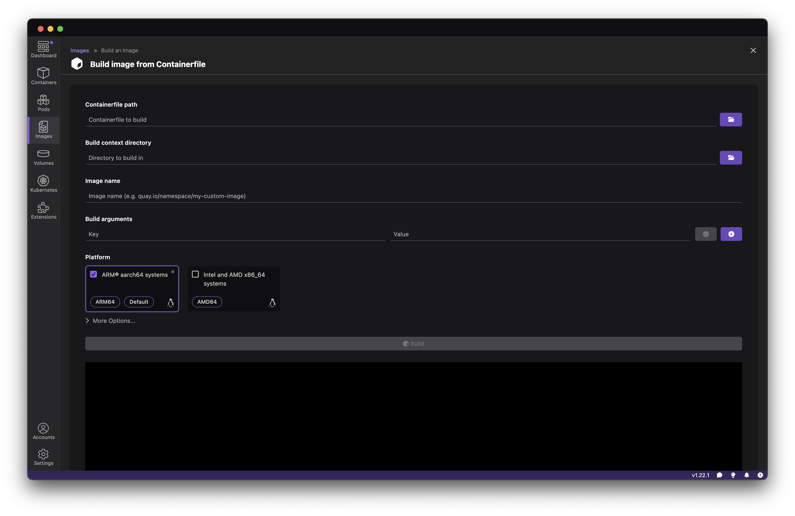

# Running the Autograder
You may choose to run the provided Autograder to get an idea of how your code will perform when I run the Autograder.
This README contains instructions for setting up and running the Autograder.

**Important**: this is optional and not required for you to do your project.
As such, I will provide limited support if you run into issues running the Autograder.

## Setting up the Autograder
The provided `Dockerfile` will be used to build the Autograder image.
It appears at the root directory of this repository; see the below screenshot.
We will use this `Dockerfile` to build the Autograder image.



### Method 1: Docker Desktop
If you are running Windows or macOS, this is the recommended way to install Docker.
1. Download and install [Docker Desktop](https://www.docker.com/products/docker-desktop/) for your machine.
    - [Instructions for macOS](https://docs.docker.com/desktop/setup/install/mac-install/)
    - [Instructions for Windows](https://docs.docker.com/desktop/setup/install/windows-install/)
    - [Instructions for Linux](https://docs.docker.com/desktop/setup/install/linux/)

2. Run Docker Desktop.
You should be met with something like the screenshot below.


3. Now, you will need to build the image.
On macOS, you will need to use the command line.
For Windows, I am not sure, but you should be able to use the command line to do this as well.

Navigate to the directory above where the `Dockerfile` lives.
Run the following command:

```
docker buildx build -t arblock/autograder:latest .
```

This will automatically build the Docker image correctly for your specified platform (e.g., x86, arm64).


### Method 2: Podman Desktop
If you are running Windows or macOS, this is the recommended way to install Podman.
1. Download and install [Podman Desktop](podman-desktop.io).
    - [Instructions for macOS](https://podman-desktop.io/docs/installation/macos-install)
    - [Instructions for Windows](https://podman-desktop.io/docs/installation/windows-install)
    - [Instructions for Linux](https://podman-desktop.io/docs/installation/linux-install)

2. Run Podman Desktop.
You should be met with something like the screenshot below.


3. Make sure that the Podman Machine is running.
Click on the bottom left tab labeled "Settings" (with the gear icon in the above screenshot), then click "Resources".
See the screenshot below for reference.



Click the "Start" button under "Podman Machine" (it is a play button "▶").

4. Now, you will need to build the image.
Podman Desktop makes this easy.
    i. Using the above screenshot as a reference, click the "Images" tab on the left.
    You will see a screen that looks something like the following screenshot.
    

    ii. At the top right corner, click the "Build" button.
    You will see a screen that looks like the following screenshot.
    

    iii. Click the folder icon to the right of "Containerfile path" on the first line.
    Here, navigate to where the `Dockerfile` lives in your repository.

    iv. For the "Image Name", enter `arblock/autograder`.

    v. For "Platform", be sure that the correct platform is selected (this should be automatically done).

    vi. Click "Build" at the bottom.

### Other methods
You may attempt to build this image via command line using `docker buildx` or `podman build`.
However, do this at your own discretion. 
While I was able to build the image successfully using `docker` on both my x86 Linux machine and arm64/v8 MacBook Pro, the image failed to run when built via `podman` on my MacBook Pro.

## Setting up your directory structure for the Autograder
If you update the repository, your directory should have the correct structure. 
If not, you need the following directory structure.

- `repository_root/`
    - `Dockerfile`
    - `project-<num>/`
        - `Firstname_Lastname_project<num>.cpp`
        - `Firstname_Lastname_project<num>.h`
        - `autograder/`
            - `results/`
            - `startup/`
                - `docker_run_grader.sh`
                - `podman_run_grader.sh`
            - `tests/`
                - `config.toml`
                - `extra/`
                - `testcases/`

Important to add are the `results`, `startup`, and `tests` directories with the appropriate structure.
Inside `startup`, there are two scripts, each one is to run the Autograder using either Docker or Podman (depending on how you set up the Autograder).
Inside `tests`, there is a `config.toml` file which controls how the Autograder runs test cases, including the weight of each test case, the total number of points, etc.
Inside `testcases`, there are `.cpp` files which will test your code.
Finally, `results` is where the Autograder will output your test results.

## Running the Autograder
Running the Autograder is simple.

1. Copy any `.h` files you are using from the `project-<num>/` directory to the `project-<num>/autograder/tests/extra/` directory. 
This is needed for the Autograder to work correctly.
Note this includes `Firstname_Lastname_project<num>.h`.

2. Within the `autograder` directory, run `./startup/docker_run_grader.sh` or `./startup.podman_run_grader.sh`, depending on if you built the Autograder with Docker or Podman.
It is important that you do not `cd` into the `startup` directory and run the Autograder from there; you must run it from the `autograder` directory for the provided scripts to work properly.

3. If everything works, the Autograder will print its results to your terminal, as well as output the results in `project-2/autograder/results/Firstname_Lastname_project<num>.cpp`.

## Writing more test cases for the Autograder
See [the Autograder documentation](https://zmievsa.github.io/autograder/#/?id=writing-testcases) for how to write test cases.
The [GitHub](https://github.com/zmievsa/autograder/) page for the Autograder also has test case examples (under the `examples` directory).

Here is an example of how to add your own test cases.
Suppose you've been asked to implement a function named `foo` that is worth 25 points.
1. In `autograder/tests/testcases`, create a file called `foo.cpp`.
2. In `config.toml`, increase the total possible points by 25 (since the `foo` function is worth 25 points in this example).
Additionally, add `'foo.cpp' = 0.25` to the `TESTCASE_WEIGHT` array.
3. Now in `foo.cpp`, make sure you include any libraries needed to construct test cases. 
You also will want to add any struct declarations here to make your life easy, as well as forward declare your `foo` function so that the compiler is aware this function exists.
4. Write test cases for your `foo` algorithm. 
You can score the test cases as follows.
    a. Using the provided `PASS()` and `FAIL()` functions.
    For example, you write 5 tests, and you pass if and only if all 5 are successful, calling `PASS()`, or calling `FAIL()` if even one test fails.
    b. Using the provided `RESULT(double res)` function.
    This function expects a double as input, as a score out of 100. 
    So, for example, you can create 3 test cases, 2 of which are worth 15 points and the last one is worth 25 (for a total of 55 points).
    If you scored 37 out of 55, you would call `RESULT(100*(score / total_possible))`; in this example, this would be `RESULT(100*(37/55))`.
